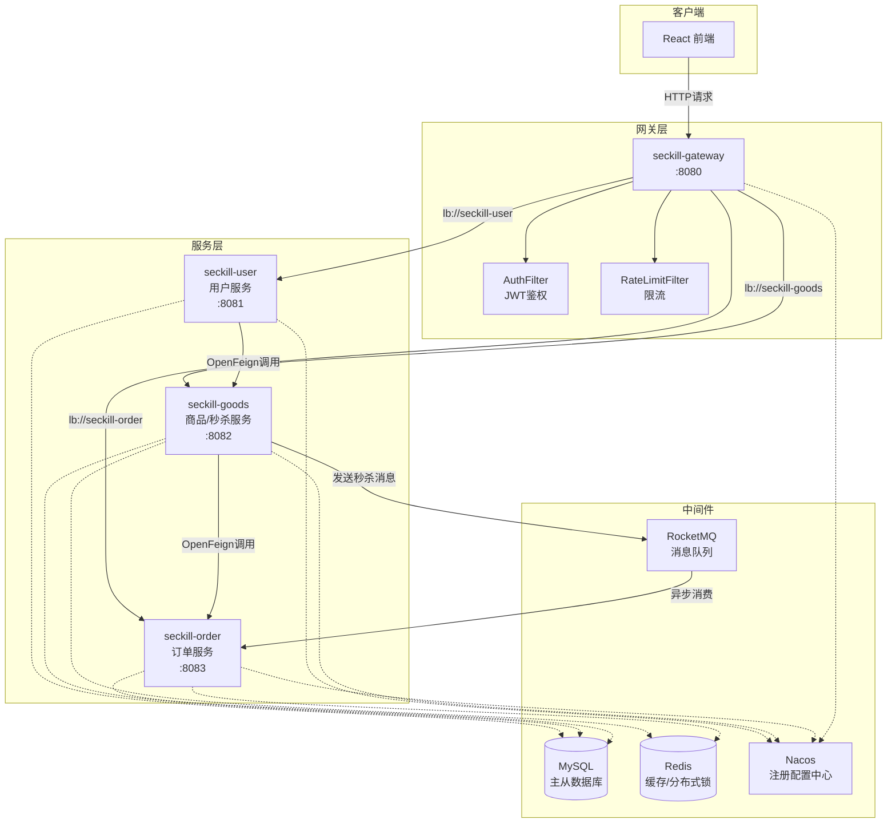
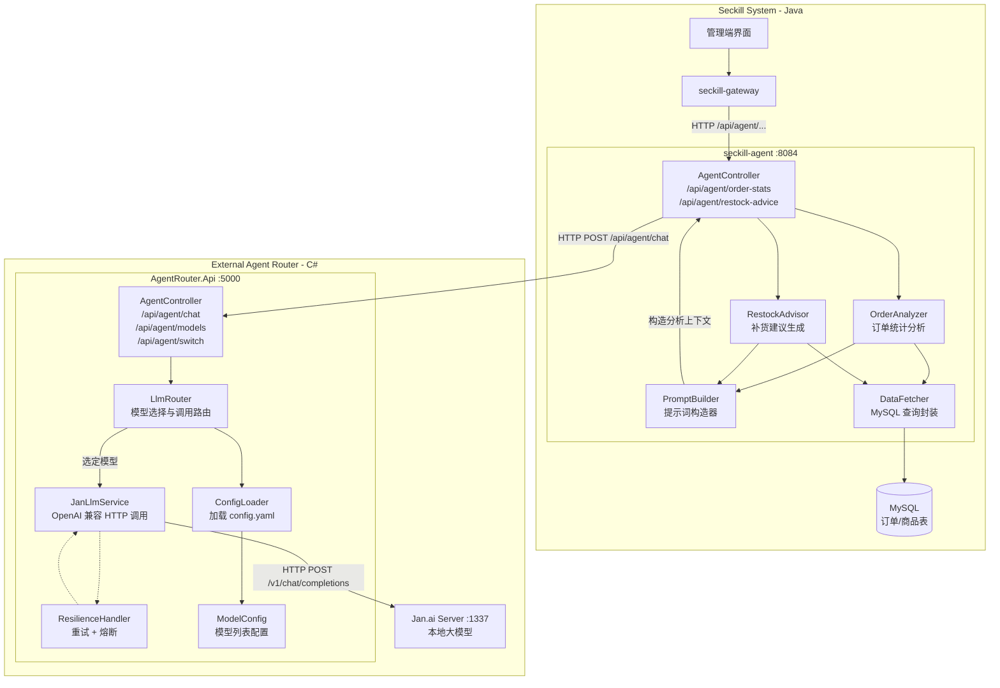

# 基于微服务架构的高并发秒杀系统与智能 Agent 增强设计报告

> **课程**：软件服务工程  
> **题目**：基于 Agent 的高并发秒杀系统智能增强
>
> 
>
> 团队贡献表：

| 姓名   | 角色      | 主要承担模块                                                 | 贡献分 |
| ------ | --------- | ------------------------------------------------------------ | ------ |
| 高俊   | Manager   | 整体架构设计、网关鉴权与分布式限流、Nacos 注册中心、核心秒杀链路（Redis Lua）、智能代理服务（seckill-admin-agent）、RocketMQ 消息消费 | 24     |
| 赵紫东 | Developer | 商品服务、商家端功能、智能代理服务扩展、C# LLM Router、需求分析与文档撰写 | 20     |
| 李恩云 | Developer | 用户服务、登录注册、网关鉴权与分布式限流、Redisson 分布式锁、React前端设计 | 19     |
| 陈宇轩 | Developer | 订单服务、用户中心功能、基本检索查询、支付模块伪实现、图片上传功能 | 17     |

---

## 1. 项目总览与需求分析

### 1.1 项目背景

本项目是《软件服务工程》课程的综合实践，小组历时三周从零设计并实现。课程要求综合运用微服务架构与 AI Agent 等课程核心知识点，构建一个具有实际工程价值的系统。

在需求调研阶段，我们选择了**电商秒杀**这一场景作为载体——它高度浓缩了互联网后端工程中最典型的几类挑战：瞬时流量峰值、库存并发安全、异步事务一致性，以及数据驱动运营决策。这些问题在真实的电商系统中均有直接对应，课程设计对它们的建模和解决，能够较为完整地覆盖课程所学的理论知识。

同时，在课程中我们接触了 AI Agent 和大模型调用的概念原理，以及这些对软件服务工程的帮助。团队里也有同学在学习Jan.ai 本地模型，发现现有的秒杀系统，接入方式很原始：每次换模型要改配置甚至改代码，容错也基本没有。这让我们想到，能不能在秒杀系统之上，加一层智能代理来主动分析数据、给建议，同时把大模型调用封装成一个稳定、可切换的服务，这样既有实际价值，也能把课程学到的微服务、韧性与 AI 知识串起来。于是，本次项目Agent方面的的核心思路就是：在不碰秒杀核心的前提下，扩展一个 Agent 来做决策辅助，再把 LLM 调用做成基础设施化的路由服务。

### 1.2 需求分析

经过分析，系统需求分为两个层次：

**核心交易层需求（高并发秒杀）**

| 需求类别 | 具体描述 |
|----------|----------|
| 防超卖 | 库存 N 件，无论并发量多大，成交量不得超过 N，要求对库存读写具备原子性保证 |
| 高吞吐 | 秒杀开始瞬间承受数万 QPS 的请求冲击，系统不崩溃、不雪崩，需多层限流防护 |
| 最终一致性 | 扣库存与建订单跨越 Redis 和 MySQL 两个存储，需保证最终数据收敛一致 |
| 用户体验 | 秒杀接口响应延迟尽可能低，"抢到"的反馈需在毫秒级内返回给用户 |
| 完整业务闭环 | 涵盖注册/登录、商品浏览、秒杀、订单支付/取消、商家端管理等完整流程 |

**智能运营层需求（Agent 增强）**

纯交易系统只能告诉你"发生了什么"，无法告诉你"该怎么做"。在课程中我们系统学习了 AI Agent 和大模型调用的原理，认为将智能分析能力注入秒杀系统有明确的工程价值：

| 需求类别 | 具体描述 |
|----------|----------|
| 数据分析自动化 | 运营人员无需手动导出数据，系统自动汇总今日大盘、销售排行、单品转化率等指标 |
| 库存智能管理 | 自动识别低库存商品并支持一键批量补货，形成"预警 → 处置"的自动化闭环 |
| LLM 基础设施化 | 大模型调用封装为独立路由服务，支持运行时热切换模型、自动重试与熔断，让 AI 能力像普通 HTTP 接口一样稳定可用 |

### 1.3 设计原则

基于以上需求，项目确立了三条核心设计原则：

1. **核心交易链路零侵入**：智能分析功能作为独立微服务部署，不修改秒杀核心任何一行代码，两层之间物理解耦。
2. **热路径全内存化**：秒杀扣减操作完全在 Redis 内存中完成，数据库只承担最终一致性同步，不参与并发竞争。
3. **AI 调用基础设施化**：LLM 路由层独立于业务服务，提供统一的模型选择、容错与热切换能力，业务侧无需关心模型细节。

---

## 2. 高并发秒杀系统设计与实现

本章介绍系统的交易核心层——高并发秒杀引擎的设计思路与架构实现，这也是整个项目的技术基底。下面从功能目标和架构原理两个层面展开。

### 2.1 功能目标

秒杀系统的核心目标极为明确：**在高并发场景下，安全、高效地完成秒杀交易**。这体现在三个不可妥协的硬指标上：

1. **防超卖**：库存只有 100 件，绝不能卖出 101 件。这要求对库存的读取和扣减必须是原子操作，任何"先读后写"的模式在高并发下都会失效。
2. **高吞吐**：秒杀活动开始的瞬间，可能有数万个请求同时涌入，系统不能崩溃也不能响应异常缓慢，需要在网关层进行有效的流量管控。
3. **最终一致性**：用户抢到商品后必须生成订单，不能出现"Redis 库存已扣但订单未创建"的数据孤岛。交易的两个步骤（扣库存、建订单）不能简单地绑在同一个同步事务里，否则数据库压力会成为瓶颈。

除上述三个核心硬指标外，系统还实现了用户注册与登录认证、商品列表与详情展示、秒杀活动全生命周期管理、订单查询与支付/取消、商家端商品 CRUD 等完整业务功能，构成可演示的交易闭环。

### 2.2 架构设计

系统采用 **Spring Cloud Alibaba 2023.0.1.2** 微服务体系，基于 **Spring Boot 3.2.5 + Java 17**，按职责拆分为五个服务加一个前端：

- **React 前端（:5173）**：面向用户的秒杀页面，展示商品列表、分类筛选与秒杀入口。
- **seckill-gateway（:8080）**：统一入口，负责 JWT 鉴权（`AuthFilter`）和基于 Redisson 的分布式令牌桶限流（`RateLimitFilter`）。
- **seckill-user（:8081）**：处理注册、登录、用户信息查询，以及商家端的商品和订单管理。
- **seckill-goods（:8082）**：管理商品信息，同时是秒杀执行的核心服务，包含 Redis Lua 原子扣减逻辑。
- **seckill-order（:8083）**：负责消费 RocketMQ 消息、幂等创建订单、处理支付与取消。

中间件层使用 **MySQL 8.0** 做持久化存储，**Redis 7.x + Redisson 3.27.2** 做缓存和分布式锁，**RocketMQ 4.9.4** 做消息队列，**Nacos v2.2.3** 做服务注册与配置中心。

秒杀系统整体架构如图 2-1 所示：



**图 2-1　秒杀系统整体架构图**

### 2.3 核心秒杀链路

秒杀链路是整个系统最值得展开分析的部分，它集中体现了"如何在高并发下保证数据安全"的设计思路。一次完整的秒杀请求经历以下五个阶段：

**① 流量管控层（Gateway）**：请求首先到达网关，`AuthFilter`（`order = -100`）从请求头、Cookie 或 Query 参数中提取 JWT Token，使用 jjwt 0.12.5 校验签名和有效期，将解析出的 `userId`/`username` 注入下游请求头，实现鉴权关注点的集中管理。随后 `RateLimitFilter`（`order = -99`）使用 Redisson 的 `RRateLimiter` 实现分布式令牌桶限流：秒杀路径（含 `/seckill`）限制为 50 QPS/IP，普通路径 100 QPS/IP，超限请求直接返回 HTTP 429，防止流量穿透到下游。

**② 内存原子扣减（seckill-goods）**：通过一段预编译的 Redis Lua 脚本，将"检查库存 → DECR → 返回剩余"三步封装为不可分割的原子操作，彻底消除并发竞态条件。脚本返回 `-1` 表示库存不足，`-2` 表示 key 不存在（触发数据库降级）。整个操作在内存中完成，耗时亚毫秒级。

**③ 异步消息解耦（RocketMQ）**：Redis 扣减成功后，商品服务使用 Snowflake ID 生成全局唯一订单号，将 `CreateOrderMessage` 序列化后通过 `syncSend` 发送至消息队列，立即返回"抢购成功"。这将用户感知延迟从"数据库写入时间"降低到"Redis 操作时间"，是系统吞吐量的关键保障。

**④ 幂等创单（seckill-order）**：订单服务消费 MQ 消息，先用 Redisson 获取分布式锁（`key = lock:seckill:{seckillId}:{userId}`），再用 `selectById(orderId)` 检查订单是否已存在，双重幂等保障后才执行 `insert`，防止 MQ 重试导致重复创单。

**⑤ 数据最终一致性**：订单成功入库后，通过 OpenFeign 回调商品服务，同步更新 MySQL 中的 `stock_count` 和 `sold_count`，保证最终一致性。取消订单时同时恢复 Redis 库存（`INCR stockKey`）和数据库记录，确保两侧数据始终收敛一致。

整套设计遵循"**挡在外面 → 内存快速响应 → 异步落库 → 多重幂等**"的层层递进原则，这是系统能在高并发场景下稳定运行的根基。

> **从「交易执行」到「辅助决策」**：秒杀引擎解决了"怎么卖"的问题，但系统的输出仍然是原始的订单记录，无法自动告诉运营人员"今日成交额多少""哪款商品快售罄""库存是否需要补货"。将数据转化为决策支撑，是第 3 章引入 Agent 层的直接动机。

---

## 3. 改进设计方案

在秒杀交易引擎之上，系统进一步构建了智能运营层，遵循一条贯穿始终的设计原则：**核心交易链路零侵入，智能分析链路物理隔离，LLM 访问基础设施化**。具体包含两个独立组件：一个 Java 微服务作为业务侧的智能代理，一个 C# 服务作为大模型访问的统一路由层。

### 3.1 新增 seckill-admin-agent 智能代理服务

`seckill-admin-agent` 是全新的第五个 Java 微服务，注册到 Nacos，运行在 **8084 端口**。它的定位极为清晰：**专门负责从业务数据中提炼信息，输出对运营人员有实际意义的决策支撑**。它与原有的商品服务、订单服务完全解耦——没有任何代码级依赖，只通过查询共享数据库和读取 Redis 获取所需数据，任意一方重启均不影响对方运行。

服务内部设计了两个核心域：

#### StockAgentService — 库存管理域

封装三类操作，构成"查询 → 预警 → 处置"的完整库存管理闭环：

| 方法 | 功能描述 | 实现亮点 |
|------|----------|----------|
| `getStock(goodsId)` | 查询商品实时库存 | Redis 优先，Miss 时降级查 MySQL，保证数据实时性 |
| `getLowStockGoods(threshold)` | 查询低库存商品列表 | 遍历所有商品，逐一调用 `getStock` 比对阈值 |
| `addStock(goodsId, addCount)` | 追加库存 | Redis `INCRBY` 原子递增 + 同步更新 MySQL，双写一致 |
| `batchRestock(threshold, target)` | 批量自动补货 | 找出全部低库存商品，计算差值，批量完成双写更新 |

#### DataAgentService — 数据分析域

提供四类分析接口，覆盖从"宏观大盘"到"单品洞察"的完整分析视角：

- **`getDashboard()`**：以今日 00:00:00 ～ 次日 00:00:00 为时间窗口，一次查询返回总单量、已支付/待支付/已取消数量、销售总金额（BigDecimal 精确求和）、活跃商品数、低库存商品数、热销商品列表——运营人员一个接口即可掌握今日秒杀全貌。

- **`getGoodsStats(goodsId)`**：计算单品的活动时长、已售比例、售罄速度（若已售罄，精确给出"X 分钟售罄"；若仍有库存，给出"已售 X%"的进度）、成交转化率（BigDecimal 精确除法，RoundingMode.HALF_UP），提供单品维度的深度分析视图。

- **`getSalesRank(start, end, limit)`**：按任意时间范围聚合订单数据，按销量降序输出 Top-N 商品排行榜，支持日维度、周维度等多时间粒度灵活查询。

- **`extendActivityTime(goodsIds, extendDays)`**：批量延期商品活动结束时间，适用于"库存有剩余但活动即将结束"的场景，直接对运营决策形成闭环支撑。

`AdminAgentController` 将上述服务封装为标准 RESTful 端点，通过统一的 `X-Agent-Token` Header 进行鉴权，全部接口如下：

| HTTP 方法 | 路径 | 功能描述 |
|-----------|------|----------|
| GET | `/admin/api/goods/{id}/stock` | 查询指定商品实时库存 |
| GET | `/admin/api/goods/low-stock?threshold=10` | 查询低库存商品列表 |
| POST | `/admin/api/goods/{id}/stock/add` | 追加指定商品库存 |
| POST | `/admin/api/goods/restock` | 批量自动补货至目标库存 |
| GET | `/admin/api/data/dashboard` | 今日秒杀大盘汇总 |
| GET | `/admin/api/data/goods/{id}/stats` | 单商品统计分析 |
| GET | `/admin/api/data/sales-rank` | 销售排行榜（支持时间范围） |
| GET | `/admin/api/data/goods` | 全商品列表（含实时库存） |
| POST | `/admin/api/goods/extend-time` | 批量延期活动结束时间 |

### 3.2 新增 C# Agent LLM Router

这是整个智能体系的**模型接入层**，以独立 C# ASP.NET Core 服务的形式存在，通过 HTTP 协议与上游 Java Agent 通信，运行在 **5000 端口**。它解决的核心问题是：让 `seckill-admin-agent` 能够安全、灵活地调用大语言模型，而无需关心模型在哪、怎么切换、出错了怎么办。之所以选择 C# 而非在 Java 侧直接集成，一方面是为了实践跨语言微服务的架构能力，另一方面也便于在不重新部署 Java 服务的情况下独立演进 AI 路由策略。

Router 内部由四个核心模块组成：

#### LlmRouter — 模型调度中心

按明确优先级决定本次请求使用哪个模型：请求体中的 `model` 字段 > HTTP Header `X-Model` > Query 参数 > `config.yaml` 的 `defaultModel`。这种优先级设计让调用方可以在不同粒度上控制模型选择——全局默认用配置文件，特定业务用 Header，临时测试用 Query 参数。服务还暴露了 `/api/agent/switch` 接口，允许在**运行时动态切换默认模型**，无需重启服务。

#### JanLlmService — HTTP 调用层

实现 `ILlmService` 接口，将内部 `ChatRequest` 对象转换为 **OpenAI 兼容格式**，向 Jan.ai 的 `/v1/chat/completions` 端点发送 POST 请求。选择 OpenAI 兼容格式是因为它已成为大模型 API 的事实标准——未来若切换到其他后端（OpenAI 云端、Ollama、通义千问等），只需新增 `ILlmService` 实现类，Router 其余部分完全不需要修改。服务支持流式（逐 token 推送）和非流式两种响应模式，满足不同前端展示场景的需求。

#### ResilienceHandler — 服务韧性层

基于 .NET 生态的 **Polly** 库实现两种容错策略，让 LLM 调用从"能跑通"升级为"可靠运行"：

- **重试策略**：针对临时性故障（网络抖动、Jan.ai 返回 502/429），采用指数退避算法自动重试，最多 3 次，延迟分别为 1s / 2s / 4s，最大不超过 10s。
- **熔断策略**：维护"关闭 → 打开 → 半开"三态状态机。连续失败 5 次后进入"打开"状态，所有请求快速失败，不再打到 Jan.ai；休眠 30s 后转为"半开"，允许一次试探性请求，成功则恢复正常，失败则重新打开。这防止了下游故障向上游 Java 服务蔓延，保护了整条智能分析链路的稳定性。

#### ConfigLoader — 配置热加载

从 `config.yaml` 读取 Jan.ai 地址、默认模型、启用模型列表及容错参数，通过文件监听机制实现热加载，修改配置后无需重启服务。

**Router 对外暴露三个端点**：

| HTTP 方法 | 路径 | 功能描述 |
|-----------|------|----------|
| POST | `/api/agent/chat` | 核心聊天接口，接收 messages 数组，返回模型回复 |
| GET | `/api/agent/models` | 返回当前启用的模型列表 |
| POST | `/api/agent/switch` | 运行时动态切换默认模型 |

### 3.3 改造后整体架构

完成以上两个组件的开发后，系统整体架构如图 3-1 所示。智能分析链路的完整调用路径为：管理端发起请求 → Gateway 转发至 `seckill-admin-agent` → Agent 查询 MySQL/Redis 获取业务数据 → 构造提示词 → 发送 HTTP POST 至 C# Router `/api/agent/chat` → Router 经 ResilienceHandler 保护，由 JanLlmService 向 Jan.ai 发起实际调用 → 大模型返回分析结论 → Agent 解析封装后响应管理端。



**图 3-1　引入智能代理后的完整系统架构图**

---

## 4. 关键技术实现

### 4.1 网关层：JWT 鉴权与分布式令牌桶限流

`AuthFilter` 实现 `GlobalFilter` 接口，`order = -100`（最高优先级）。过滤器内维护白名单路径列表（`/user/login`、`/user/register`、`/goods/list` 等），命中则直接放行。其余请求依次从 `Authorization Bearer Header`、`Cookie`、`Query` 参数三处提取 Token，使用 jjwt 0.12.5 校验签名与有效期，通过后将 `userId` 和 `username` 注入下游请求头（`X-User-Id`、`X-Username`），下游服务无需再解析 JWT，实现了鉴权逻辑的集中管理。

`RateLimitFilter` 基于 Redisson `RRateLimiter` 实现分布式令牌桶。秒杀路径限制为 50 QPS/IP，普通路径 100 QPS/IP。令牌桶实例初始化后缓存于 `ConcurrentHashMap`，避免每次请求都调用 `trySetRate` 造成 Redis 额外开销。调用 `tryAcquire()` 时使用 `Schedulers.boundedElastic()` 切换到弹性线程池，防止阻塞 Netty 的 I/O 事件循环线程，确保响应式编程模型的正确性。

### 4.2 核心秒杀：Redis Lua 原子扣减

`SeckillService` 在静态初始化块中预编译 Lua 脚本，将检查库存、扣减、返回结果三步封装为原子操作：

```lua
if redis.call('exists', KEYS[1]) == 1 then
    local stock = tonumber(redis.call('get', KEYS[1]))
    if stock > 0 then
        redis.call('decr', KEYS[1])
        return stock - 1      -- 返回剩余库存
    else
        return -1             -- 库存不足
    end
else
    return -2                 -- key 不存在，触发数据库降级
end
```

Redis 单线程执行模型保证了脚本的原子性，彻底消除"先读后写"的竞态条件。系统在商品首次被秒杀时将库存从 MySQL 预热到 Redis（`ensureRedisInitialized`），后续所有并发请求均在内存中完成扣减，数据库不参与热路径，这是系统能扛住高并发的核心所在。

此外，`enrichStatus` 方法根据 `startDate`/`endDate` 与 `LocalDateTime.now()` 动态计算活动状态（准备中/进行中/已结束），优先级高于数据库静态字段，从根本上避免了"状态值不随时间自动更新"的数据偏差问题。

### 4.3 异步解耦：RocketMQ 消息队列

Redis 扣减成功后，`SeckillService` 使用 Snowflake 算法生成全局唯一的 64 位有序订单 ID，构造 `CreateOrderMessage`（包含 orderId、userId、goodsId、seckillPrice），序列化为 JSON 后通过 `rocketMQTemplate.syncSend` 发往 `SECKILL_ORDER_TOPIC`。同步发送确保消息成功投递至 Broker 才返回，若发送失败则立即回滚 Redis 库存，保障数据一致性。

`OrderCreateConsumer` 使用 `@RocketMQMessageListener` 监听同一 Topic，消费失败时抛出 `RuntimeException` 触发 RocketMQ 自动重试机制，直到成功消费或进入死信队列。

### 4.4 幂等保障：Redisson 分布式锁

`OrderService.createSeckillOrder` 先用 `redissonClient.getLock(lockKey)` 获取分布式锁（`tryLock` 等待 3s，持有超时 30s），进入临界区后用 `selectById(orderId)` 检查订单是否已存在，确认不存在再执行 `insert`。`finally` 块通过 `isHeldByCurrentThread()` 判断后再释放，防止锁被其他线程错误释放。

**双重幂等设计**（分布式锁 + 订单主键唯一检查）使得即使 MQ 重复推送同一消息，也不会产生重复订单。

### 4.5 前端：商品展示与分类搜索

前端基于 React 18 + TypeScript + Vite 构建。`GoodsList` 页面使用 `useMemo` 实现客户端管道计算：先按商品名称或 ID 进行文本搜索过滤，再按分类过滤，最后按状态和价格排序，切片出当前页（每页 12 条）进行展示。所有状态通过 `getEffectiveStatus` 函数根据 `startDate`/`endDate` 动态计算，与后端 `enrichStatus` 逻辑完全对称。

---

## 5. 开发过程中遇到的核心难题与解决方案

在实际开发过程中，高并发场景暴露了若干深层次的工程难题，以下四个问题最具代表性。

### 5.1 难题一：高并发下库存超卖——原子性如何真正保证？

**【问题描述】**

在进行并发压测时，我们发现即使对 `stock_count` 字段加上了乐观锁版本号（`version`），在极高并发下仍然偶发超卖现象。经分析，根本原因在于：乐观锁的"先读取 version → 更新时校验 version"模式虽然能防止脏写，但在"库存恰好为 1、N 个线程同时读到 version=X"的边界场景下，仍然存在大量 CAS 重试失败后的线程重新排队竞争的情况，系统吞吐量急剧下降，且在重试窗口期内存在数据不一致的短暂窗口。

更深层的问题是：数据库层面的乐观锁解决的是写冲突，但秒杀场景的真正难点在于**读写之间的时间窗口**——"读到库存 > 0"和"执行扣减"之间哪怕只有几微秒的间隔，在极高并发下都会造成多线程同时通过检查并执行扣减。

**【解决方案】**

将"检查库存是否充足"和"执行库存扣减"两步操作迁移到 **Redis + Lua 脚本**中执行。Redis 的单线程执行模型从根本上保证了脚本的原子性——没有并发，没有竞态，检查和扣减对外表现为一个不可分割的原子操作。

```lua
-- 脚本原子性保证：Redis单线程，以下三步不可被打断
local stock = tonumber(redis.call('get', KEYS[1]))
if stock > 0 then
    redis.call('decr', KEYS[1])
    return stock - 1   -- 成功
end
return -1              -- 库存不足
```

同时，库存数据提前预热到 Redis（活动开始前写入，首次访问时按需初始化），让整个热路径完全在内存中完成，数据库只承担最终同步的职责。这一改动将超卖率降为零，且因为省去了数据库行锁竞争，系统吞吐量反而有显著提升。

**【经验总结】**

高并发场景下，"用数据库锁解决并发"的思路本身就是错误的起点——数据库的锁机制是为事务一致性设计的，不是为高吞吐并发设计的。真正的解法是：**将热路径上所有需要原子性的操作迁移到单线程内存存储（Redis）中执行，数据库只做最终持久化**。

---

### 5.2 难题二：消息重复消费与分布式幂等——如何防止重复订单？

**【问题描述】**

在网络抖动或 Broker 重启的场景下，RocketMQ 的消息可能被重复投递。测试中我们确实发现了同一用户、同一商品产生两条订单的情况，而且两条订单都是合法的数据库记录，没有触发任何约束异常。

问题的复杂性在于：RocketMQ 的 At Least Once 投递语义本身就不保证消息只被消费一次，这是分布式系统的基本特性。想要在 At Least Once 投递之上实现 Exactly Once 语义，必须在消费端自行实现幂等。

**【解决方案】**

设计**双重幂等防护**机制：

第一道防线：**Redisson 分布式锁**。以 `seckillId:userId` 为 key，确保同一商品和同一用户的创单请求在同一时刻全局只有一个线程在处理，将并发问题转化为串行问题。

```java
String lockKey = "lock:seckill:" + seckillId + ":" + userId;
RLock lock = redissonClient.getLock(lockKey);
if (!lock.tryLock(3, 30, TimeUnit.SECONDS)) {
    throw new BusinessException(ResultCode.SECKILL_ILLEGAL_REQUEST);
}
```

第二道防线：**订单 ID 唯一性检查**。进入锁内后先执行 `selectById(orderId)` 查询，如果订单已存在则直接返回，不再重复 insert。因为 orderId 是在 Redis 扣减成功时由 Snowflake 生成的，同一次秒杀行为生成的 orderId 是固定的，天然具备幂等 key 的性质。

两道防线各有侧重：分布式锁防的是并发重试下的"同时进入"，订单 ID 检查防的是极端网络异常下锁失效后的"重复插入"。任何一道单独使用都存在理论上的漏洞，组合使用才能在工程上达到可接受的幂等保证。

**【经验总结】**

分布式系统的幂等设计永远是"多道防线"而非"单一银弹"。选择幂等 key 时，要优先使用业务语义唯一的 ID（此处为 Snowflake orderId），而不是自行维护一张幂等记录表，这样既减少了存储开销，也降低了幂等逻辑与业务逻辑的耦合度。

---

### 5.3 难题三：Redis 库存与数据库库存的双写一致性问题

**【问题描述】**

秒杀链路中，Redis 负责实时库存扣减，MySQL 负责最终持久化。两者之间存在一段时间窗口：Redis 扣减成功但 MQ 消息尚未被订单服务消费时，如果此时查询数据库，看到的库存仍然是扣减前的值。更严重的是，当订单被取消、库存需要回滚时，需要同时恢复 Redis 和 MySQL 两侧的数据，任何一侧失败都会导致数据永久不一致。

在实际测试中，我们发现在高频取消订单的场景下，确实出现了 Redis 库存和数据库库存数值不同步的情况，导致前端展示的库存与实际可售数量产生偏差。

**【解决方案】**

明确定义两套库存的职责边界，并建立严格的同步规范：

- **Redis 库存**：唯一的秒杀热路径权威数据源，所有扣减和恢复操作必须以 Redis 为准。
- **MySQL 库存**：最终一致性副本，只通过订单服务的 OpenFeign 回调异步同步，不参与秒杀热路径。

对于取消订单的库存恢复，采用"Redis 先恢复、MySQL 再同步"的顺序，且两步操作各自独立处理异常——Redis 恢复失败则整体抛异常回滚；MySQL 同步失败仅记录错误日志，不影响订单取消的完成。

```java
// 取消订单时的库存双写恢复
redisTemplate.opsForValue().increment(stockKey);    // 优先恢复Redis
redisTemplate.opsForValue().decrement(soldKey);
try {
    goodsFeignClient.restoreStock(seckillId);       // 异步回调同步DB
} catch (Exception e) {
    log.error("同步恢复数据库库存失败: seckillId={}", seckillId, e); // 只记录，不抛出
}
```

此外，`seckill-admin-agent` 在查询库存时也采用"Redis 优先、Miss 降级 MySQL"的策略，确保管理端看到的库存数据与实际可售状态保持最高一致性。

**【经验总结】**

双写一致性问题在分布式系统中无法做到强一致，只能设计合理的最终一致性方案。关键在于：**明确哪个是主数据源（Redis），明确什么情况下允许短暂不一致，以及在不一致时哪侧的数据优先级更高**。

---

### 5.4 难题四：JavaScript 数字精度问题导致"订单不存在"

**【问题描述】**

用户点击"去支付"按钮后，前端弹出"订单不存在"的错误，但订单明确存在于数据库中。通过浏览器开发者工具打印订单 ID，发现原始值 `2059872127036805121` 在 JavaScript 中变成了 `2059872127036805000`，末三位被精度截断为 `000`，前端发回的 ID 与数据库中的实际 ID 不匹配。

**【根本原因】**

JavaScript 的 `Number` 类型为 64 位 IEEE 754 双精度浮点，最大安全整数为 `2^53 - 1 = 9007199254740991`。而 Snowflake 算法生成的 ID 通常在 `2^63` 量级，远超这一上限。Java 后端通过 JSON 序列化将 `Long` 直接输出为数字时，JavaScript 在解析时会发生精度丢失，导致前后端看到的 ID 完全不同。

**【解决方案】**

在 `seckill-common` 模块新增全局 Jackson 配置，将所有 `Long`/`long` 类型序列化为字符串：

```java
@Configuration
public class JacksonConfig {
    @Bean
    public Jackson2ObjectMapperBuilderCustomizer longToStringCustomizer() {
        return builder -> {
            builder.serializerByType(Long.class, ToStringSerializer.instance);
            builder.serializerByType(long.class, ToStringSerializer.instance);
        };
    }
}
```

由于所有服务主类均通过 `scanBasePackages` 扫描了 `com.seckill.common`，该配置对全部服务自动生效，零代码侵入。前端 TypeScript 接口将相关 ID 字段类型改为 `string`，服务端 `@PathVariable` 自动将字符串解析回 `Long`，全链路完全透明。

**【经验总结】**

全局将 `Long` 序列化为字符串是 Java + JavaScript 全栈项目的标准实践，建议在项目初期就作为基础配置纳入。Snowflake ID 一旦进入前端展示，精度问题必然暴露，不能等到测试时才发现。

---

## 6. 最终成果

### 6.1 系统功能全貌

| 功能模块 | 具体能力 | 核心技术 |
|----------|----------|----------|
| 用户端秒杀 | 商品列表（12条/页）、分类筛选、名称搜索、实时库存展示、秒杀下单 | React useMemo + 客户端分页 |
| 用户端订单 | 订单列表、支付、取消、实时状态 | Snowflake ID 字符串序列化 |
| 商家端管理 | 商品 CRUD（含名称/分类/图片/价格/活动时间）、订单查看 | Spring Cloud Gateway 转发 |
| 网关鉴权 | JWT 校验、白名单放行、用户信息透传下游 | jjwt 0.12.5 + GlobalFilter |
| 分布式限流 | 按 IP 分桶、秒杀路径 50 QPS、普通路径 100 QPS | Redisson RRateLimiter |
| 核心秒杀 | 原子扣减、MQ 异步创单、双重幂等保障 | Redis Lua + RocketMQ + Redisson |
| 库存智能管理 | 实时库存查询、低库存预警、一键批量补货、双写同步 | Redis INCRBY + MySQL UPDATE |
| 销售数据分析 | 今日大盘、单品统计（含售罄速度/转化率）、销售排行榜、活动延期 | MyBatis-Plus LambdaQueryWrapper |
| LLM 路由 | 多模型选择、运行时热切换、指数退避重试、熔断自恢复 | C# Polly + OpenAI 兼容接口 |
| 测试数据 | 34 条真实秒杀商品（8 类别、20 进行中 / 8 准备中 / 6 已结束） | SQL 种子数据 |

### 6.2 完整技术栈

| 层次 | 技术选型 | 版本 |
|------|----------|------|
| 运行时 | Java | 17 (LTS) |
| 框架基础 | Spring Boot | 3.2.5 |
| 微服务治理 | Spring Cloud + Spring Cloud Alibaba | 2023.0.1 + 2023.0.1.2 |
| 网关 | Spring Cloud Gateway（响应式 WebFlux） | — |
| ORM | MyBatis-Plus | 3.5.6 |
| 缓存/分布式锁 | Redis + Redisson | 7.x + 3.27.2 |
| 消息队列 | RocketMQ | 4.9.4 (Broker) + 2.3.0 (Starter) |
| 服务注册 | Nacos | v2.2.3 |
| 数据库 | MySQL + Druid 连接池 | 8.0.33 + 1.2.21 |
| ID 生成 | Snowflake（自实现） | — |
| 前端 | React + TypeScript + Vite | 18 + 5.x + 5.x |
| LLM 路由 | C# ASP.NET Core + Polly | .NET 8 |
| 本地大模型 | Jan.ai | :1337 |
| 容器化 | Docker + Docker Compose | — |


---

## 7. 总结与反思

本次课程设计以高并发秒杀场景为基础，在完成交易核心功能的基础上，进一步扩展了智能运营代理层和 LLM 路由基础设施，将微服务架构、高并发设计、服务韧性与 AI 知识串联成了一条完整的工程实践链路。

**技术层面**，我们深刻体验了微服务架构的两面性：服务拆分带来了职责清晰、独立扩缩容的优势，但也引入了分布式一致性、跨服务调用延迟和中间件运维复杂度等新挑战。Redis Lua 脚本、RocketMQ 异步解耦、Redisson 分布式锁这三者的组合，是目前主流电商系统解决秒杀防超卖问题的工业级标准方案，亲手实现一遍后，对其背后的设计动机有了远比阅读文档更深刻的理解。

**工程层面**，几个棘手问题的排查过程让我们认识到：在分布式系统中，大量真正难搞的 Bug 不是业务逻辑错误，而是并发竞态、数据一致性、版本兼容性等"工程性"问题。这类问题往往不在编译期暴露，只在特定并发负载下才复现，需要对底层机制有清晰认知才能快速定位根因，这是大学课程中很难通过纯理论教学传递的能力。

**设计理念层面**，`seckill-admin-agent` 的"只读查询、不参与写事务"原则，以及 C# Router 与 Java Agent 的跨语言 HTTP 解耦，体现了微服务架构中"关注点分离"的核心价值：每个服务只做一件事，服务之间的边界越清晰，系统整体的演进灵活性就越高。

**未来展望**：计划将 C# LLM Router 与 `seckill-admin-agent` 正式对接，让 `DataAgentService` 的分析数据经由 PromptBuilder 构造提示词后，调用 Jan.ai 本地大模型生成自然语言的运营建议报告；同时为智能代理添加 WebSocket 主动推送能力，实现低库存实时预警；以及通过 JMeter 进行系统级压力测试，对网关限流阈值和 Redis 预热策略进行数据驱动的精细调优。

---

*报告撰写：小组全体成员　2026 年 5 月*
